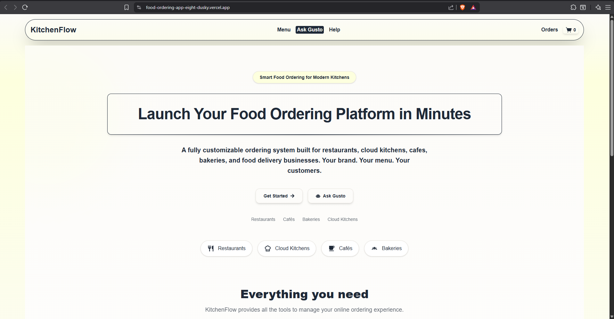
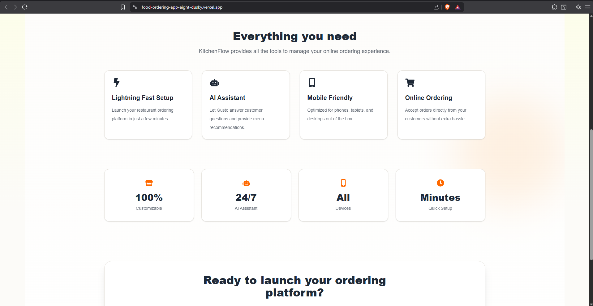
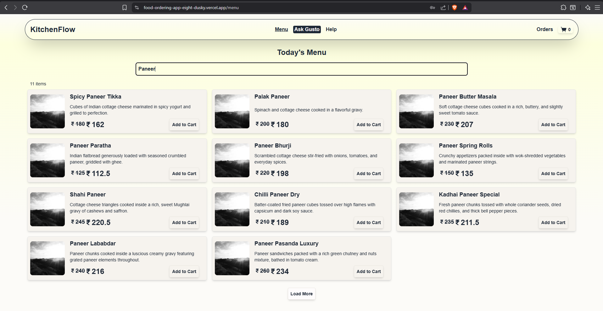
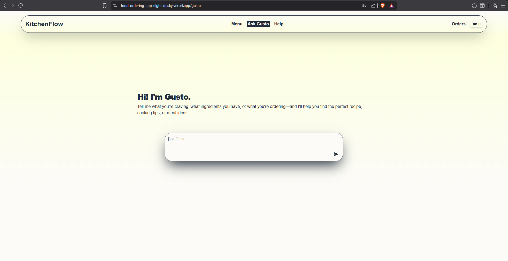
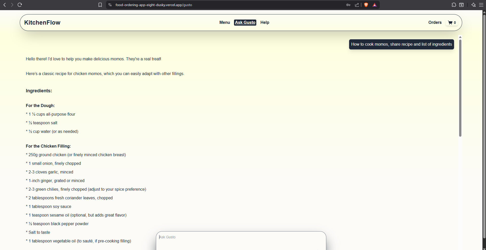

# 🍽️ KitchenFlow – AI Powered Food Ordering Platform

<p align="center">
  <strong>Smart Food Ordering for Modern Kitchens</strong>
</p>

<p align="center">
  A configurable, white-label food ordering platform built with React, TypeScript, Redux Toolkit, and Tailwind CSS.
</p>

---

## 🚀 Overview

KitchenFlow is a modern food ordering platform designed for restaurants, cafés, bakeries, cloud kitchens, and food delivery businesses.

The application is fully configurable through a centralized UI configuration, making it easy to customize branding, colors, menus, and user experience without changing the application code.

It also includes **Gusto**, an AI-powered assistant that helps customers navigate menus, answer questions, and improve the ordering experience.

---

## ✨ Features

- 🍽️ Beautiful and responsive ordering experience
- 🤖 AI-powered assistant (Gusto)
- 🛒 Cart management
- 📋 Dynamic menu rendering
- ⚙️ Config-driven UI
- 🎨 Theme customization
- 📱 Mobile-first responsive design
- ⚡ Built with Vite for lightning-fast development
- 🔄 Redux Toolkit state management
- 🧩 Reusable component architecture

---

## 🖥️ Demo

> Add your deployed application link here.

**Live Demo**

https://food-ordering-app-eight-dusky.vercel.app

---

## 📸 Screenshots

### Landing Page

> Add screenshot




### Menu



### AI Assistant




---

## 🛠️ Tech Stack

### Frontend

- React 18
- TypeScript
- Vite
- Redux Toolkit
- React Router
- Tailwind CSS v4
- React Icons
- React Hot Toast

---

## 📦 Installation

Clone the repository

```bash
git clone https://github.com/sarthakmishraa/food-ordering-app.git
```

Navigate to the project

```bash
cd food-ordering-app/client
```

```bash
cd food-ordering-app/server
```

Install dependencies

```bash
npm install
```

Start the development server

```bash
npm run dev
```

Open

```
http://localhost:5173
```

---

## 🎨 Configuration Driven UI

KitchenFlow is designed to be configurable.

Example configuration

```json
{
  "appTitle": "KitchenFlow",
  "tagline": "Smart Food Ordering for Modern Kitchens",
  "hero": {
    "title": "Launch Your Food Ordering Platform in Minutes",
    "description": "A fully customizable ordering system..."
  }
}
```

The configuration controls:

- Branding
- Hero section
- Colors
- Typography
- Theme
- Future feature flags

---

## 🤖 Gusto AI

Gusto is an AI-powered restaurant assistant that can help users:

- Recommend dishes
- Answer menu questions
- Explain ingredients
- Assist with ordering
- Improve customer experience

---

## 🎯 Roadmap

- [x] Landing Page
- [x] Dynamic Menu
- [x] Cart
- [x] Config Driven UI
- [x] AI Assistant
- [ ] Authentication
- [ ] Order Tracking
- [ ] Payments
- [ ] Restaurant Dashboard
- [ ] Admin Portal
- [ ] Analytics

---

## 🧩 Architecture

```text
                 UI Config
                     │
                     ▼
              Redux Toolkit
                     │
                     ▼
      ┌────────────────────────┐
      │ React Components       │
      └────────────────────────┘
          │      │       │
          ▼      ▼       ▼
       Landing  Menu   Gusto AI
```

---

## 📜 Available Scripts

Start development server

```bash
npm run dev
```

Build production

```bash
npm run build
```

Preview production build

```bash
npm run preview
```

Lint

```bash
npm run lint
```

---

## 👨‍💻 Author

**Sarthak Mishra**

- GitHub: https://github.com/sarthakmishraa
- LinkedIn: https://linkedin.com/in/sarthakmishraa

---

## ⭐ Support

If you found this project useful, consider giving it a ⭐ on GitHub!

It helps others discover the project and motivates future development.

---

## 📄 License

This project is licensed under the MIT License.
